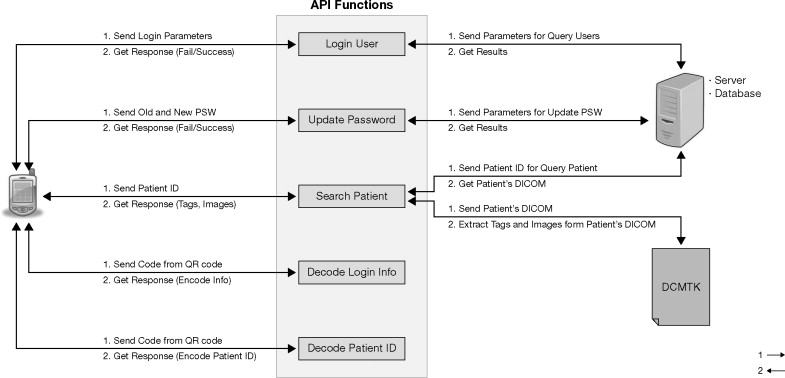
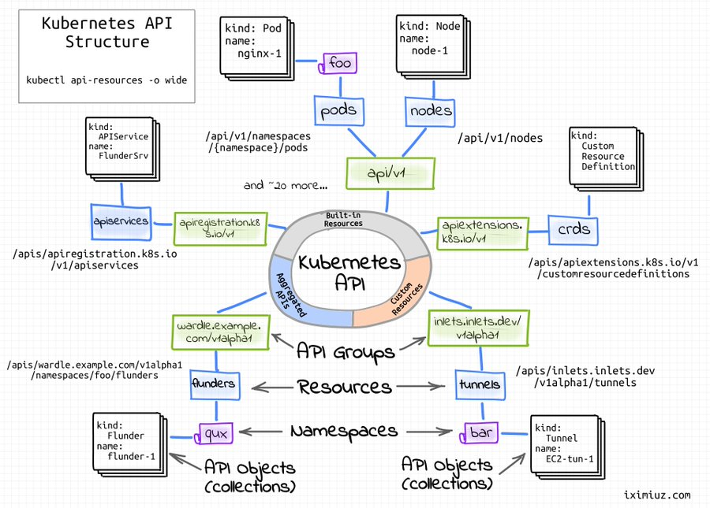

# What are APIs? How are they used and why are they so popular?
APIs (Application Programming Interfaces) are sets of rules and protocols that allow different 
software applications to communicate with each other. They act as intermediaries, providing a 
structured way for applications to exchange data and functionality.

# Create a diagram to showcase the data transfer process in API communication.

# What is a REST API? 

REST (Representational State Transfer) is an architectural style for designing networked 
applications, primarily used for web services. It defines a set of constraints that, when 
applied, create a simple, scalable, and maintainable API.

# What makes an API RESTful?
A RESTful API adheres to the following constraints:

- **Statelessness**: Each request is treated independently, without relying on previous requests. 
This makes the API scalable and easier to maintain.
- **Client-Server Architecture**: The API separates concerns between the client 
(the application making the request) and the server (the application providing the service).
- **Cacheable**: Responses can be cached to improve performance and reduce load on the server.
- **Layered System**: The API can be layered to support modularity and scalability.
- **Uniform Interface**: The API uses a uniform interface, typically HTTP methods 
(GET, POST, PUT, DELETE, etc.) and URIs to represent resources.

# REST Guidelines:
1. Use HTTP methods appropriately.(GET,POST,PUT,DELETE,PATCH)
2. Use URIs to represent resources: URIs should be descriptive and consistent.
3. Leverage HTTP status codes: Use appropriate HTTP status codes to indicate the success or
failure of a request.
4. Support caching: Implement caching mechanisms to improve performance and reduce load on 
the server.
5. Use HATEOAS (Hypertext As The Engine Of Application State): Allow clients to discover 
available actions and resources through the API responses.

# Benefits of RESTful APIs:
- Scalability: RESTful APIs are designed to be scalable, handling increasing loads efficiently.
- Flexibility: They are flexible and can support various use cases.
- Maintainability: RESTful APIs are easier to maintain and evolve over time.
- Interoperability: between different systems.

By following these guidelines, you can create robust, scalable, and maintainable RESTful APIs that are 
easy to use and understand.

# What is HTTP? (what does it stand for and what is it used for? What is HTTPS?)
HTTP stands for Hypertext Transfer Protocol. It is a set of rules used for transmitting data
on the internet. 

HTTP is used to communicate between web browsers and web servers

When you type a URL into your browser, the browser sends an HTTP request to the web server. 
The web server then processes the request and sends an HTTP response back to the browser.

# Explain HTTP request structure using the diagrams provided, or your own.

# Explain HTTP response structure using the diagram provided, or your own.

# What are the 5 HTTP verbs and what do they do?

GET → ?Retrieve a resource.
POST → Create a new resource.
PUT → Update an existing resource.
PATCH → Delete a resource.
DELETE → Apply partial updates to a resource.

# What is statelessness? Show examples of “stateless” and stateful http requests.
Statelessness in HTTP means that each request is treated independently, without any 
reference to previous requests. This means that the server does not maintain any state or
session information for a client between requests.

Examples of Stateless HTTP Requests
1. Retrieving a webpage: When you request a webpage from a server, the server processes the
request, sends the page, and forgets about the request. If you request the same page again
later, the server will process it as a new, independent request.
2. Searching for a product: When you search for a product on an e-commerce website,
the server processes your search query, retrieves the relevant results, and sends them to you. 
There is no state maintained between your searches.
3. Making a payment: When you make a payment on a website, the server processes the payment
information and sends a confirmation. There is no state maintained to remember your 
previous payments.

# What is caching?
Caching is a technique used to store frequently accessed data in a temporary storage area 
(cache) that is closer to the source of the request, such as a web browser or a web server.
This reduces the latency and improves the performance of applications.

Here's how caching works:
1. Request: When a user requests a resource (e.g., a webpage, image, or video), the system 
first checks if the resource is cached locally.
2. Cache Hit: If the resource is found in the cache, it is served directly from the cache,
bypassing the need to fetch it from the original source.
3. Cache Miss: If the resource is not found in the cache, it is fetched from the original 
source and stored in the cache for future requests.